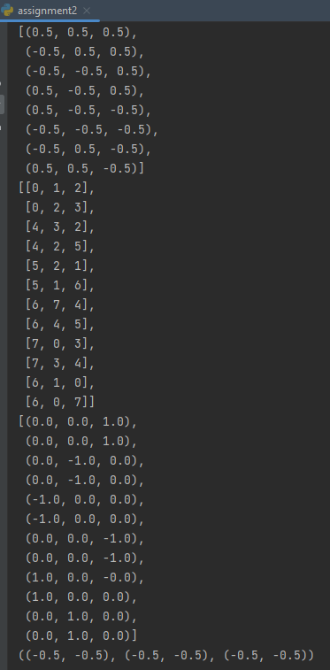
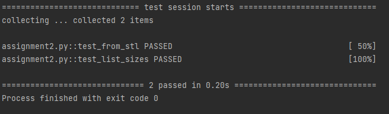
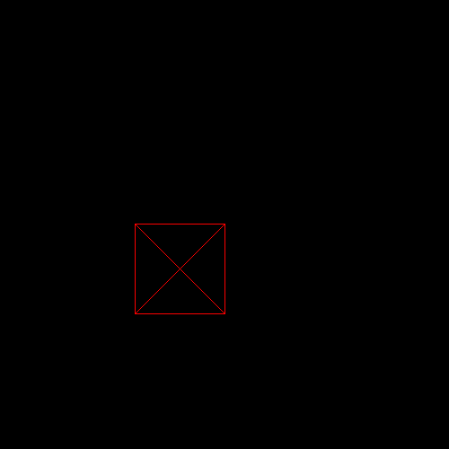

# Programming Assignment 2

Class: CS 4204 (Computer Graphics), Fall 2024

Professor: Brendan David-John

## Overview

In this programming assignment, you are going to complete the second step towards building our renderer: the mesh module. As discussed in class, our renderer is going to be composed of several independent modules. The mesh module is responsible for definining mesh data as a collection of triangles represented via vertices and faces and for implementing relevant transformations in the rendering pipeline. Specifically, it will provide a class called `Mesh` that can load an stl file. An stl file for a simple unit cube consisting of 6 faces with 2 triangles each is provided. Please read the entire document before starting the assignment.


## Instructions

For this assignment, you will create a python file called `mesh.py`, and within that file there will be a class called `Mesh`. `Mesh` needs to be implemented as detailed below. Now that we know how to display a buffer of pixel values on the screen, we need to start implement the processing pipeline for 3D objects to eventually shade and display them. Specifically, you will implement a pipeline to read in an stl file (numpy-stl is reccomended) and generate lists of vertices, triangle faces, and normals. In this assignment we make use of printed numeric checks on known meshes to validate solutions, as true visual validation is not possible until we have methods to shade objects in our raster renderer.

*Hint*: this might be a good time to introduce a helper class for necessary mathematical structures such as 3D vectors.

### Output

The following should be the output when `assignment2.py` is run:

```bash
python assignment2.py
```



The following should be the output when pytest with the verbose flag is run:

```bash
pytest -v assignment2.py
```



### Dependency Management
Each assignment will include a requirements.txt file that includes the python package requirements for the assignment. If you are using PyCharm it should automatically detect and install the dependencies when you create the virtual environment. Otherwise, [these instructions](https://www.jetbrains.com/help/pycharm/managing-dependencies.html#configure-requirements) will help you manually manage the requirements in PyCharm. If you are using something other than PyCharm, you can use the command line to manually install the packages from the requirements.txt file:

```bash
pip install -r requirements.txt
```

Assignment 2 introduces a requirement for numpy-stl==3.0.1 

## The Mesh Class

### Exposed Members

#### `verts`
List of 3D vertices <x,y,z> for the mesh.

#### `faces`
List of triangle faces for the mesh, with each face defined as a list of 3 vertex indicies into `verts` in counter clockwise ordering.

#### `normals`
List of 3D face normals for the mesh. The elements of this list correspond to the same triangles defined in `faces`.

### Exposed Methods

#### `__init__(self)`
The constructor takes no required arguments.

#### `from_stl(stl_path)`
This static method takes an stl file as input, initializes an empty Mesh object and populates the `verts`, `faces`, `normals`, and `bounds` member variables. The method returns the populated Mesh object.

## Extra Credit
If you wish to receive the 1 extra credit point, you can finish implementing the script `assignment2_extra_credit.py` to use the line drawing functionality of `Screen` from assignment 1 to visualize your newly loaded mesh file. The visualization can ignore the z component of this data, and simply draw lines connecting the x and y components of each vertex within each face in the `faces` list. Note, the mesh file is in model space, with coordinates ranging from -0.5 to 0.5. To accomodate this, your implementation should scale all x and y values by `s = 100` and then translate all of the values by `dx = 200` and `dy = 200` to place the vertices within the defined `Screen` object.



## Rubric
There are 10 points (11 with extra credit) for this assignment:
- *1 pts*: pytest test_from_stl passed without raising an exception
- *1 pts*: pytest test_list_sizes passed
- *4 pts*: Printed verts, faces, and normals values match expected output (see above)	
- *4 pts*: Printed verts, faces, and normals values match expected output for a held out stl file not provided as part of this repo